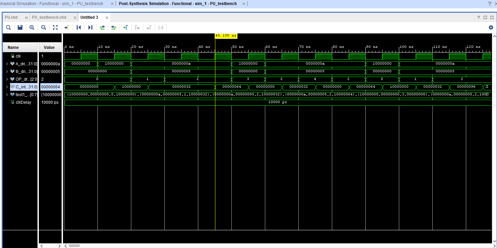

# oook
Final project for memory centric computing, [check out the paper](paper.pdf)

This project contains the [code](src) and testbench for a Processing Element (PE) capable of Multipy, Add, and Multiply & Accumalte. 

# Waveform PE Simulation
The wave form shows the following instrcutions in order
1. ADD 10000000 to 0
2. MUL 10 n 5 to get 50
3. MAC 10 n 5 to get 50
4. MAC 10 n 5 to get 100
5. CLR to get 0
6. MAC 10 n 5 to get 50
7. NOP to get 0
8. MAC 10 n 5 to get 100

